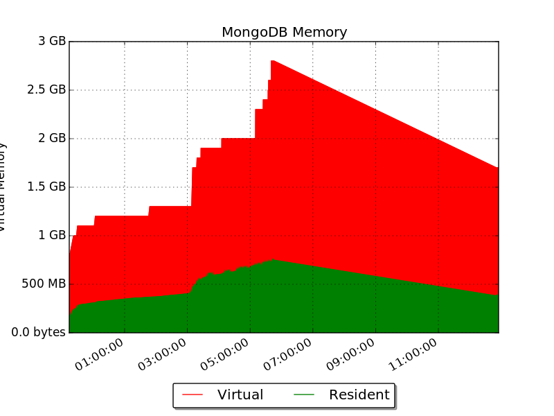
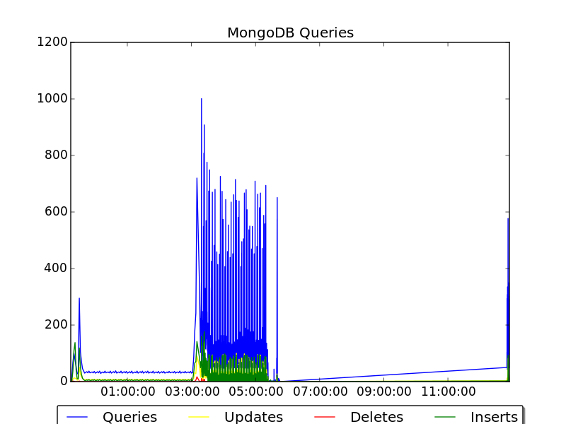
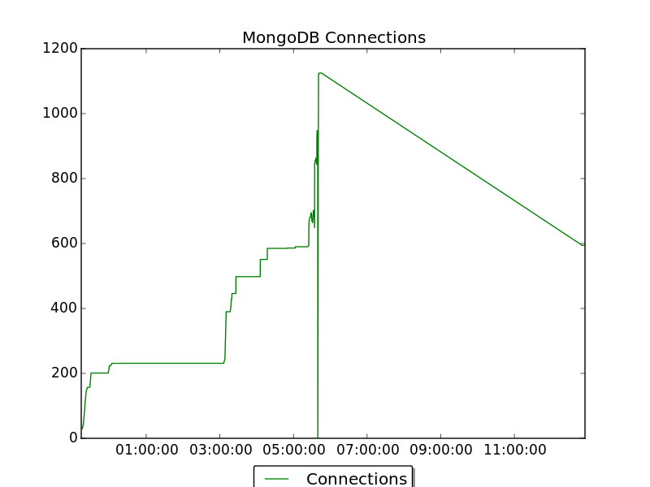

# juju-perf-collector

Set of tools to capture and process performance related metrics. At the moment
the following metrics can be captured:

* `collect-mongostat.py`: collect mongostat output in a gziped file, each line
  contains a json object.
* `collect-pprof.py`: connect to juju's unix socket to collect pprof reports,
  this script generates a tar.xz file which contains one file per report, the
  report's filename is `$REPORT_NAME.%Y%m%d_%H%M%S`. For more details about
  the content of each report see
  https://github.com/juju/juju/wiki/pprof-facility
* `strip-pprof.py`: Remove (HTTP) headers from a pprof report
* `graph-mongostat.py`: generate `matplotlib` based graphs of captured
  mongostat output.

## Graph Mongostat

